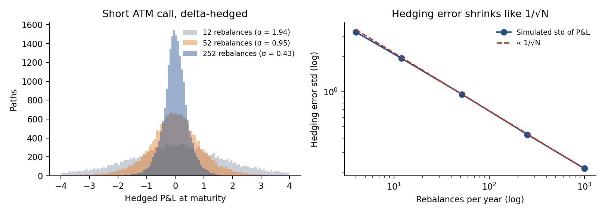
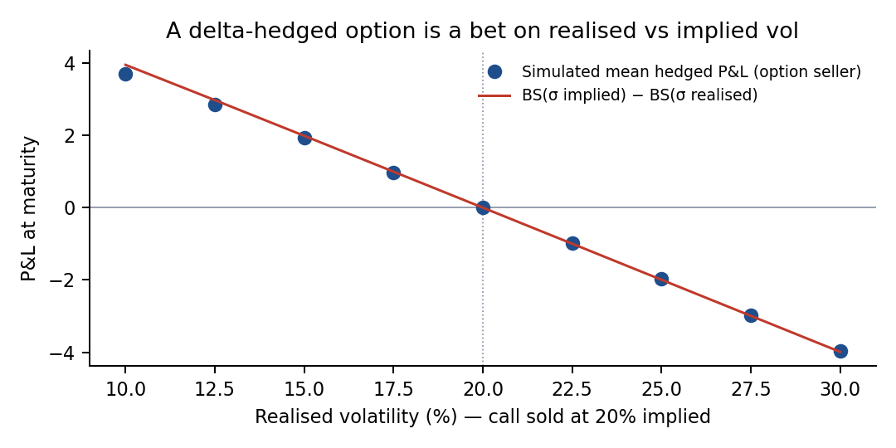
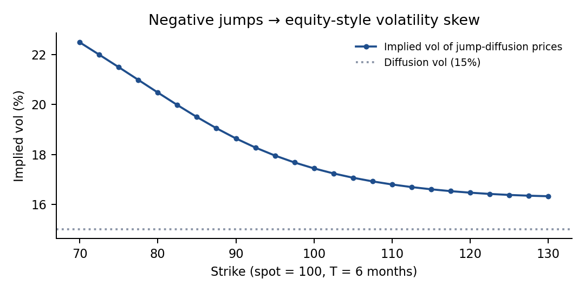

# Options Lab — pricing, Greeks & hedging from scratch

A small Python library and set of experiments that implement the core of derivatives pricing
(Hull, *Options, Futures and Other Derivatives*) and test **when the theory works in practice**.

<p align="center">
  
</p>
<p align="center">
  
  
</p>

📄 **Full write-up:** [Options_Lab_Report.pdf](Options_Lab_Report.pdf)

| Module | What it does |
|---|---|
| `optlab/pricing.py` | Black-Scholes-Merton (with dividend yield), analytical Greeks, CRR binomial tree (European & American), Monte Carlo with antithetic variates, implied volatility (Newton-Raphson + bisection fallback) |
| `optlab/hedging.py` | GBM path simulation, discrete delta-hedging of a short call, minimum-variance futures hedge ratio, beta hedging with index futures |
| `optlab/jumps.py` | Merton jump-diffusion pricer, used to generate an implied-volatility skew |
| `tests/` | 11 unit tests: Hull reference values, put-call parity, no-arbitrage bounds, tree→BS convergence, American vs European, MC error, IV round-trip, Greeks vs finite differences, hedging error |
| `scripts/run_experiments.py` | Reproduces every figure in `figures/` and every number in `results.json` |

## Key findings

1. **Binomial → Black-Scholes.** The CRR price of an ATM call oscillates around the BSM value
   (9.4134) and converges: error −0.04 at 50 steps, −0.005 at 400 steps.
   An American put (K = 110) is worth 0.68 more than its European twin: that's the early-exercise premium.
2. **Discrete delta hedging.** For a short ATM 1-year call hedged under BSM assumptions, the std of
   the hedged P&L falls from 21% of the premium (monthly rebalancing) to 4.5% (daily) and
   2.3% (1,000×/year). The error scales like **1/√N**, as theory predicts.
3. **A hedged option is a volatility trade.** Selling the call at 20% implied vol and delta-hedging
   gives a mean P&L that matches BS(σ<sub>implied</sub>) − BS(σ<sub>realised</sub>):
   about +1.9 if realised vol is 15%, about −2.0 if it is 25%.
4. **Cross-hedging with futures.** Replicating Hull's jet-fuel example, the regression hedge ratio
   (h* ≈ 0.75 estimated vs 0.78 true) removes 86% of the variance out-of-sample, against 79% for a naive h = 1.
5. **Why there is a skew.** Prices from a jump-diffusion with negative jumps, inverted through
   Black-Scholes, give an implied vol of 22.5% at K = 70 vs 17.4% ATM: the equity skew comes from crash risk.

## Run it

```bash
pip install numpy scipy matplotlib pytest
pytest -q                          # 11 tests
python scripts/run_experiments.py  # figures + results.json (~20 s)
```

## Limitations / next steps
- Constant volatility and rates in the hedging simulations; no transaction costs yet
  (adding a bid-ask cost would show the trade-off between hedging error and cost).
- Next: calibrate implied vols to real option quotes (e.g. Euro Stoxx 50 or S&P 500 chains)
  and backtest a delta-hedged straddle on historical data.
